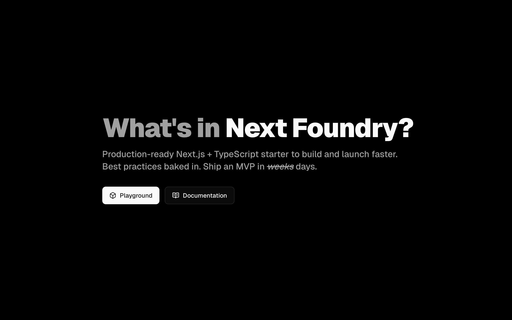

<div align="center">

# Next Foundry

**Production‑ready Next.js + TypeScript starter. Skip the boilerplate. Start building.**

<a href="https://next-foundry.vercel.app">
  
</a>

</div>

## Table of Contents

1. [Why Next Foundry?](#why-next-foundry)
2. [What You Get](#what-you-get)
3. [Tech Stack](#tech-stack)
4. [Quick Start](#quick-start)
5. [Database & Prisma](#database--prisma)
6. [Authentication (Better Auth)](#authentication-better-auth)
7. [Email (Resend + React Email)](#email-resend--react-email)
8. [Rate Limiting](#rate-limiting)
9. [Security Posture](#security-posture)
10. [Project Structure](#project-structure)
11. [Contributing](#contributing)
12. [License](#license)

## Why Next Foundry?

Launching your next big idea shouldn’t start with a week of wiring auth, email, databases, and other repetitive scaffolding. **Next Foundry** gives you a _lean but production‑minded_ starting point:

- Auth (Magic link + Google) already implemented
- Transactional email templates + delivery
- Rate limiting with Redis (Upstash)
- Strong typing, validation, DX conveniences
- A visual playground showcasing each integration

## What You Get

| Area                 | Included                                        |
| -------------------- | ----------------------------------------------- |
| Auth                 | Better Auth (Magic link + Google)               |
| Database             | Prisma + Accelerate                             |
| Emails               | Resend + React Email templates                  |
| UI                   | Shadcn UI, Radix primitives, theming, dark mode |
| Rate Limiting        | Upstash Redis based limiter                     |
| Analytics / Metadata | Vercel edge functions                           |
| Forms                | React Hook Form + Zod resolvers                 |
| URL State            | nuqs                                            |
| Time                 | day.js                                          |
| Charts               | Recharts                                        |
| Motion               | Motion (Framer)                                 |
| Maps                 | Leaflet                                         |
| AI                   | AI SDK + OpenAI adapter demo                    |

## Tech Stack

**Core**

- Framework: `Next.js 15` (Turbopack)
- Language: `TypeScript`
- Styling: `Tailwind CSS v4` + utility composition (`class-variance-authority`, `tailwind-merge`)
- Auth: `better-auth`
- ORM: `Prisma` (+ optional Accelerate extension)
- Database: `PostgreSQL`
- Validation: `zod`
- Forms: `react-hook-form`
- Email templates: `@react-email/components`
- Email delivery: `resend`
- Rate limiting: `@upstash/ratelimit` + `@upstash/redis`
- Icons: `lucide-react`
- Charts: `recharts`
- AI: `ai` + `@ai-sdk/react` + `@ai-sdk/openai`
- Maps: `leaflet`, `react-leaflet`
- Themes: `next-themes`
- URL state: `nuqs`
- Animation library: `motion`

**Tooling**

- Linting: `eslint` + `eslint-config-next` + `prettier`
- Type checking: `tsc`
- Dead code analysis: `knip`
- Git hooks: `husky` + `lint-staged` (configure as needed)

---

## Quick Start

### 1. Scaffold a New Project

```bash
pnpm dlx degit george-swift/next-foundry my-app
cd my-app
pnpm install
```

### 2. Copy and Configure Environment

```bash
cp .env.example .env
```

Edit `.env` and fill all required values (see [Environment Variables](#environment-variables)).

### 3. Generate Prisma Client & Push Schema

```bash
pnpm db:generate
pnpm db:push
```

### 4. Start Dev Server

```bash
pnpm dev
```

Visit: `http://localhost:3000/playground` to explore widgets.

## Database & Prisma

Prisma schema lives in `src/prisma/schema.prisma`. Generated client output is placed under `src/lib/generated/prisma` (custom output path). Common tasks:

```bash
pnpm db:generate     # Regenerate client
pnpm db:push         # Push schema changes (development)
pnpm db:migrate      # Create migration with prompt
pnpm db:studio       # Open Prisma Studio
```

To create a migration:

```bash
pnpm db:migrate --name add_user_profile_fields
```

---

## Authentication (Better Auth)

Magic link + Google OAuth are pre-wired.

Key files:

- `src/lib/auth.ts` – server auth configuration (plugins, providers, magic link email sender)
- `src/lib/auth-client.ts` – client utilities (`signIn`, `signOut`, `useSession`)
- `src/app/api/auth/[...all]/route.ts` – Better Auth Next.js route handler
- `src/app/playground/_widgets/auth.tsx` – Login widget in the playground to demo authentication

### Adding Another Supported Provider

Follow [the guide](https://www.better-auth.com/docs/concepts/oauth) on Better Auth

### Magic Link Flow

1. User submits email
2. Server action called
3. Email with time‑boxed token delivered via Resend
4. Clicking verifies and establishes session

## Email (Resend + React Email)

Sample Templates: `magic-link`, `delete-account`, `service-test` under `src/app/playground/_components/email-templates/`.

Send test service email from the Playground UI (`resend` widget).

## Rate Limiting

Sample setup located in `src/lib/rate-limit.ts`. Uses Upstash Redis token bucket via `@upstash/ratelimit`. [See the docs](https://upstash.com/docs/redis/overall/getstarted) to get started.

Apply in server actions or API routes:

```ts
await rateLimit({ actionType: 'auth.magicLink', identifier: ip })
```

You may define or centralize allowed `actionType` values to avoid typos.

## Scripts

| Script           | Purpose                           |
| ---------------- | --------------------------------- |
| `dev`            | Start Next.js dev (Turbopack)     |
| `build`          | Production build                  |
| `start`          | Run production server             |
| `lint`           | Lint sources                      |
| `lint:fix`       | Auto-fix issues                   |
| `typecheck`      | TypeScript project check          |
| `format`         | Prettier write all                |
| `format:check`   | Prettier verify                   |
| `db:generate`    | Prisma client generate            |
| `db:push`        | Push schema to DB (no migration)  |
| `db:migrate`     | Create/apply migration in dev     |
| `db:studio`      | Prisma Studio UI                  |
| `analyze`        | Dead code / unused exports (Knip) |
| `security:audit` | Run `pnpm audit` (non‑failing)    |

---

## Security Posture

Baseline features:

- Session + cookie protections handled by Better Auth
- Magic link tokens time‑scoped
- Rate limiting on sensitive actions
- Input validation via Zod

Recommended enhancements (not included by default):

- Add `middleware.ts` with strict security headers. Learn more [here](https://nextjs.org/docs/app/guides/production-checklist#security)
- Structured logging
- Audit trail table for sign‑ins & deletes

> This starter is **security‑aware**, but _not_ a compliance framework. Always threat model your own domain logic.

---

## Project Structure

```
src/
	app/
		api/auth/[...all]/route.ts   # Better Auth API catch-all
		playground/                  # Interactive widgets showcase
	lib/
		auth.ts                      # Better Auth server config
		auth-client.ts               # Better Auth client
		prisma.ts                    # Prisma client
		rate-limit.ts                # Upstash rate limiter config
	components/ui/                   # Shadcn UI components
	components/providers/            # Theme, Nuqs providers
    prisma/                          # Prisma schema
      schema.prisma
```

## Contributing

PRs welcome. Please read the [Contributing Guidelines](CONTRIBUTING.md) for detailed information.

## License

This project is licensed under the MIT License. See the [LICENSE.md](LICENSE.md) file for details.

---

If this starter saves you time, consider leaving a star ⭐️ on the repository
